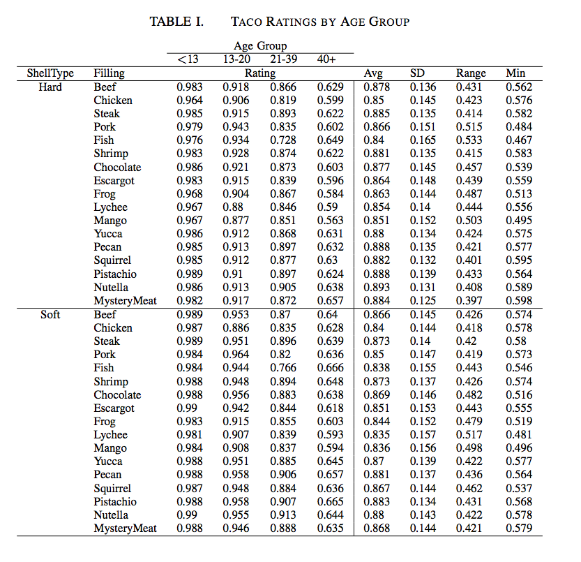

<style type="text/css">
.table{
margin-bottom: 20px;
max-width: 100%;
width:0;
}
</style>

```{r, echo=FALSE}
knitr::opts_chunk$set(message = FALSE)
knitr::opts_chunk$set(warning = FALSE)
knitr::opts_chunk$set(fig.width = 10)
knitr::opts_chunk$set(fig.align = 'center')
```

##The Problem

_This is Bob:_


Bob is a scientist.

Bob likes science, and Bob likes doing science. Bob likes to run lots of experiments, and Bob has lots of results from these experiments. Not only that, Bob wants to share his results with the world. To do that, he has to publish papers. There is just one thing in his way...

_This is Bill:_


Bill is a reviewer. 

Bill also likes science, but Bill _hates_ bad science. Bob has to prove to Bill that his science is good science, and that people in the world deserve to read his science. 

One day, Bob did some science. Bob is a Taco Scientist. He came up with some great new taco fillings and wanted to compare them to the traditional Beef, Chicken, Steak, Pork, Fish, and Shrimp tacos. He also compared them using hard and soft taco shells, and asked different age groups what they thought of each taco. He sent his paper to Bill for review, along with this table summarizing his results:



Bill did not like this at all. While he is an avid taco fan, Bill is a very busy man, and he does not have time to stare at a large table full of numbers to try to understand Bob's results. Bill sent the paper back, and Bob was sad. Bob was sad because he _knew_ his experiments were good, but he did not communicate the results effectively. 

_To convince Bill that he has done good science, Bob must communicate his ideas and experiments effectively. The first step in this process is actually doing good science. The experiments must be well designed, the impact clearly articulated, and the results well documented. Today, we focus on the latter, and more specifically, how to document and communicate large amounts of results in bite-sized pieces called figures._

So, after doubting his scientific abilities and questioning his purpose in life, Bob set out to change his destiny. Bob was determined to get his paper accepted. To do this, he knew he had to summarize his results better. After much soul and Internet searching, Bob discovered R.

_This is R:_

<div style="font-size: 200pt; font-weight=bolder; margin-top: 0px">R</div>

R is a letter.

R is also a _[free software environment for statistical computing and graphics](http://www.r-project.org/)_. Bob fell in love. He found that R was able to take his horrendous tables and turn them into wonderful representations of his beautiful experimental results.

## Let's Get Started!

First, we will load Bob's taco results into a _Dataframe_. Dataframe's are a lot like tables, except you can perform operations on them and use them as input for figures. The `kable()` function is just a way of printing your Dataframes out in an easy-to-read manner, and it is part of the `knitr` package, so we use the `library()` function to load it. The `head()` function prints just the top few rows of the dataframe. To see how any function or library works, just do `??my_func` to bring up the help content for it.

If you would like to follow along, you can download the `taco_results.csv` file [here](http://rikturr.com/wp-content/uploads/2015/06/taco_results.csv)

```{r, warning=FALSE}
library(knitr)
taco.results <- read.csv('taco_results.csv')
kable(head(taco.results))
```

If you are following along and don't have any packages that Bob uses, just call `install.packages("my_package")` and R will install it for you.

First, Bob just wanted to know how people like his beef tacos. To do that, he has to subset his `taco.results` dataframe to only get those talking about the Beef filling. He uses the `dplyr` package. He can do this with the functions in R, but `dplyr` makes things nice and simple. [Check out this quick cheat sheet on how to manipulate dataframes](http://www.rstudio.com/wp-content/uploads/2015/02/data-wrangling-cheatsheet.pdf).

```{r}
library(dplyr)
beef.ratings <- filter(taco.results, Filling == "Beef")
kable(head(beef.ratings))
mean(beef.ratings$Rating)
```

##Bob' First Figure

Time for some graphics! Let's see how the different age groups like both the hard and soft beef tacos. The `ggplot2` package is our best friend here. You always start by calling the `ggplot()` function, passing your dataframe as the first argument, then using the `aes()` function to specify the various aestheic aspects of the graph. You then add other functions to the `ggplot()` call depending on what you want to do. In this case, we want a bar chart, so we use `geom_bar()`. Looks like older people dont seem to like beef tacos, and the ratings don't change much between the hard or soft taco shells.

```{r warning=FALSE, fig.height=5}
library(ggplot2)
ggplot(beef.ratings, aes(x = AgeGroup, y = Rating, fill = ShellType)) + 
  geom_bar(stat = "identity", position = "dodge")
```

For a full overview of the `ggplot2` package, check out the _[R Graphics Cookbook](http://www.cookbook-r.com/Graphs/)_, written by the author of the package. There is a lot more that ggplot can do that we do not discuss here.

##Histograms

Bob wondered what the distribution of his taco ratings were. A simple histogram will suffice.

```{r}
ggplot(taco.results, aes(x = Rating)) + geom_histogram(binwidth=0.01)
```

##Facets
Bob is feeling good about his ggplot skills, let's try comparing all the different taco fillings. To make multiple plots, we can use the `facet_grid()` or `facet_wrap()` functions. We do the same thing as before, except we are using the original `taco.results` dataframe to compare every filling.

```{r, fig.height=7, fig.width=7}
ggplot(taco.results, aes(x = AgeGroup, y = Rating, fill = ShellType)) + 
  geom_bar(stat = "identity", position = "dodge") +
  facet_wrap( ~ Filling, ncol = 3, scales = "free_x")
```

Oh no, this is almost as bad as the big table. Bob realized that making good visualizations of his results is not that easy. Let's try other ways of summarizing this table (we'll come back to facets later).

##Horizontal Bar Chart
Bob wants to see how each filling is rated overall. To do this, we take the average rating for each filling across all age groups and shell types. Notice that we flip the axis and do some theme-related things to make the plot look nicer.

```{r, warning=FALSE, fig.width=7}
filling.results <- taco.results %>%
  group_by(Filling) %>%
  summarise(Rating = mean(Rating))

ggplot(filling.results, aes(x = Filling, y = Rating, fill = Filling)) + 
  geom_bar(stat = "identity", position = "dodge", alpha = 0.7) + 
  coord_flip(ylim=c(0.8,0.875)) +
  theme_bw(base_size = 18)  + guides(fill=FALSE) 
```

Let's keep this simple theme for all the following graphs using `theme_set()`:

```{r, cache = FALSE}
theme_set(theme_bw(base_size = 18))
```

Wow, it seems like people really like Bob's new flavors! Who would've thought that Pecan or Pistachio tacos would be so good? Bob has one problem with this chart, though. He doesn't know how skewed these number are with respect to different shell types or the different age groups. Let's see if Bob can remedy this with a boxplot.

##Boxplots

```{r, fig.width=8}
ggplot(taco.results, aes(x = Filling, y = Rating, fill = Filling)) + 
  geom_boxplot(alpha = 0.5) + guides(fill=FALSE) + coord_flip()
```

Remember Bob's big table? The second half of it is just descriptive stats about each row (Shell Type / Filling). A boxplot can summarize these numbers with ease ([quick refresher on boxplots](http://flowingdata.com/2008/02/15/how-to-read-and-use-a-box-and-whisker-plot/)). Let's replicate that part of the table with a facet. 

```{r}
ggplot(taco.results, aes(x = Filling, y = Rating, fill = Filling)) + 
  geom_boxplot(alpha = 0.5) + guides(fill=FALSE) +
  facet_grid(. ~ ShellType) + coord_flip()
```

Something is still missing. Bob can see that there is deviation between ratings, but he doesn't know _why_. This is when things tend to get complicated. Bob's experiment has a lot of factors, so he can't just do a simple xy plot to see all the trends in his data. Let's try different ways of grouping the data with different plots to find the best one. We've already seen that bar charts faceted by Filling do _not_ work.

##Jitter

Let's say Bob wants a quick overview of his results in just one plot. He uses `geom_jitter()` to make a scatter plot that jitters the x values to better visualize the different values in the data.

```{r, fig.width=7, fig.height=5}
ggplot(taco.results, aes(x = AgeGroup, y = Rating,  color = ShellType)) + 
  geom_jitter(size=2)
```

##Density Curves

Bob starts thinking about his histogram again, what are the distributions for each age group?

```{r}
ggplot(taco.results, aes(x = Rating, fill=AgeGroup)) + geom_density(alpha=0.3)
```

##Violin

Bob's getting fancy now. Violin plots allow us to visualize the multiple distributions on one plot. Each violin is a density curve flipped and mirrored for each of the groups.

```{r, fig.width=7, fig.height=7, warning=FALSE}
ggplot(taco.results, aes(x = AgeGroup, y = Rating, fill = AgeGroup)) + 
  geom_violin(color = "black", alpha = 0.3)
```

These two plots show some trends between the age groups and shell types, but what about the fillings?

##Line Graphs

Bob had an idea. He wants to see how ratings for each filling change as the age group increases. Perfect time for a line graph, wouldn't you say, Bob?

```{r, fig.height=10, fig.width=10}
ggplot(taco.results, aes(x = AgeGroup, y = Rating, group=ShellType, color=ShellType)) + 
  geom_line(size=1) + geom_point(size=3) + theme(axis.text.x  = element_text(size=12)) + 
  facet_wrap( ~ Filling, ncol = 3,scales = "free_x")
```

If you notice, this is almost the same graph as that big bar plot that Bob hastily threw together earlier. The big difference is that he used `geom_line()` and `geom_point()` rather than `geom_bar()`. What a difference one line of code makes! 

##Heatmaps

The more mathemtical folks in the audience might have trouble with Bob's last plot. Bob did a line plot without having a continous x variable. Let's see if a heatmap will show the same trend while keeping the math people happy.

```{r}
ggplot(taco.results, aes(AgeGroup, Filling)) + 
  geom_tile(aes(fill = Rating), color = "white") + 
  scale_fill_gradient(low = "white", high = "steelblue") +
  facet_grid(. ~ ShellType)
```

These last two plots were very useful; it seems that as people get older, they tend to rate tacos lower, regardless of the filling or shell type. Bob smells a bias.

##ANOVA & HSD

This isn't a tutorial on statistical analysis with R ([for that, check this out](http://rpubs.com/dalupus/84391)), but Bob would be remiss without doing some HSD tests and plotting them with ggplot. Bob does a quick ANOVA test (please note the horrible statistics of this, there is only one sample for each observation):

```{r, fig.width=7}
library(agricolae)
taco.anova <- aov(Rating~ShellType*AgeGroup,data = taco.results)
summary(taco.anova)
HSD.test(taco.anova, "AgeGroup", alpha = 0.5, console = TRUE)

taco.hsd <- data.frame(TukeyHSD(taco.anova,"AgeGroup", conf.level=.95)$AgeGroup)
taco.hsd$Comparison <- row.names(taco.hsd)

ggplot(taco.hsd, aes(x = Comparison, y = diff, ymin = lwr, ymax = upr, color=Comparison)) +
  geom_pointrange(size=1.2) + coord_flip() + guides(color=FALSE) +
  ylab("Difference in Mean Rating by Age Groups")
```

##Saving Plots

Bob likes having automated processes, so he wants to be able to export his plots from within R scripts. To do that, he just wraps two lines of code around the plot he wants to export. PDFs use vector graphics, so they be easily scaled for use in papers.

```{r, eval = FALSE}
pdf("taco_hsd.pdf", height=6, width=10)
ggplot(taco.hsd, aes(x = Comparison, y = diff, ymin = lwr, ymax = upr, color=Comparison)) +
  geom_pointrange(size=1.2) + coord_flip() + guides(color=FALSE) +
  ylab("Difference in Mean Rating by Age Groups")
dev.off()
```

##Bob's Victory

_The New Bob:_


Armed with his new visualization skills, Bob marched his paper back to Bill and got it accepted.

Congrats, Bob!

###Moral of the story:
Use figures in your papers and you will become rich and famous just like Bob.